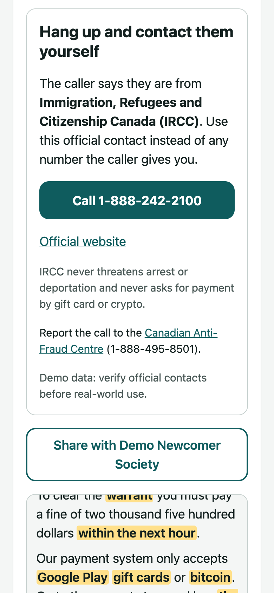

<div align="center">

# TrustLine 📞

## Project Description 🚨

TrustLine helps newcomers to Canada recognize scam tactics during financial phone calls. During a suspicious call, the user taps Add Call, chooses TrustLine and merges it in, the same way they would add a friend to a three-way call. TrustLine transcribes the conversation in real time, flags tactics such as gift card payment requests, deportation threats and requests for one-time codes, and explains each warning in the user's chosen language, both on the user's screen and out loud on the call. When the caller claims to represent an institution, TrustLine shows that institution's official contact channel from a verified directory so the user can hang up and check independently. With the user's consent, a redacted incident summary is shared with the user's community organization or credit union, which can publish an advisory that reaches users of every partner organization.

## Screenshots:

<div style="display: flex; justify-content: center; align-items: center;">
    <kbd></kbd>
    <kbd></kbd>
    <kbd></kbd>
    <kbd></kbd>
    <kbd></kbd>
    <kbd></kbd>
    <kbd></kbd>
</div>

## Technologies Used 💻

### Frameworks

- [x] **React + TypeScript (Vite)**: Mobile-first single-page app with strict TypeScript
- [x] **Supabase Realtime**: Live incident feed and advisory banners across devices
- [x] **Zod**: Validation of every risk assessment on the server and again in the browser
- [x] **Vitest**: Unit tests for detection, fusion, redaction, directory matching and colour contrast

### APIs & Web Services

- [x] **ElevenLabs Scribe v2 Realtime**: Streaming speech-to-text from the microphone
- [x] **ElevenLabs Text to Speech (Eleven v3)**: Spoken warnings in all five languages, generated as phone audio
- [x] **ElevenLabs Agents**: Scripted scam and legitimate callers for testing and the demo
- [x] **Twilio Programmable Voice**: The TrustLine phone number and bidirectional Media Streams
- [x] **Anthropic Claude (Haiku 4.5 by default)**: Structured risk scoring and translated explanations
- [x] **Vercel**: Hosting and serverless API routes

### Data Sources

- [x] **Verified directory**: Official contact channels for IRCC, CRA, CBSA, Service Canada, police and major banks (demo data, see `src/data/directory.ts`)
- [x] **Evaluation set**: 17 labelled scam and legitimate call transcripts in `eval/cases.ts`

</div>

## Architecture 🏗️

- **Pattern**: Feature folders (`src/features/call`, `src/features/partner`) with shared logic in `src/lib`
- **Detection**: A rules layer flags known tactics in about 0.01 ms per transcript. Claude reads the recent transcript and returns structured JSON with flags, the claimed organization, exact evidence quotes and an explanation in the listener's language. Rules can raise risk immediately; only the LLM can lower it, and never when the rules found gift cards, crypto, one-time codes or remote access.
- **Input**: Neither iOS nor Android lets third-party apps read cellular call audio. Instead, the user merges the TrustLine number into the call. A call server receives the audio from Twilio, sends it to Scribe (which accepts Twilio's 8 kHz mu-law directly), scores it, speaks a warning back into the call on the first high-risk moment, and streams the call to the user's app over Server-Sent Events. The app can also listen through the microphone of a second device, and scripted demo calls run through the same pipeline.
- **State**: React state and hooks; one `CallAnalysis` component per call, keyed so state resets between calls
- **Data**: `DataStore` interface with a Supabase implementation and a local implementation (localStorage + BroadcastChannel) used when Supabase is not configured
- **Security**: API keys stay on the server. The browser receives single-use transcription tokens. Incidents are redacted on the device before they are sent.
- **Target**: Current mobile Safari and Chrome; Node 20+

```
Phone call ──merge──▶ Twilio number ──media stream──▶ call server (server/)
                                                         │  Scribe ─▶ rules + Claude ─▶ spoken warning ─▶ back into the call
                                                         ▼
                                              Server-Sent Events ─▶ app (same pipeline as below)

Microphone ──▶ Scribe v2 Realtime ──▶ committed segments
                                         │
                       ┌─────────────────┴─────────────────┐
                       ▼                                   ▼
                Rules layer (instant)             /api/score (Claude)
                       └──────────────┬────────────────────┘
                                      ▼
                         fuse() ──▶ warning, evidence, verified contact
                                      │ (consent)
                                      ▼
              redact() ──▶ incidents ──▶ partner dashboard ──▶ advisories ──▶ every partner's users
```

## Features 🌟

- 🎙️ **Live transcript**: Real-time transcription of a speakerphone call
- 🚩 **Evidence-backed warnings**: The exact words that triggered each flag are highlighted
- 🌐 **In-language explanations**: Warnings in English, Punjabi, Mandarin, Tagalog and Farsi, with right-to-left layout for Farsi
- ☎️ **Verified next step**: Official contact channels instead of caller-supplied numbers
- 🤝 **Partner advisories**: Consent-based, redacted reports shared across community organizations and banks
- 📊 **Diagnostics**: Measured alert latency for the rules and LLM layers

## Getting Started 🚀

```bash
npm install
cp .env.example .env   # add keys; every key is optional
npm run dev
```

Open `http://localhost:5173` for the app and `http://localhost:5173/partner` for the partner dashboard.

| Setting                                       | Without it                                                                                |
| --------------------------------------------- | ----------------------------------------------------------------------------------------- |
| `ELEVENLABS_API_KEY`                          | Live listening is unavailable; demo calls still work                                      |
| `ANTHROPIC_API_KEY`                           | Basic mode: warnings come from the rules layer only                                       |
| `VITE_SUPABASE_URL`, `VITE_SUPABASE_ANON_KEY` | Incidents and advisories are shared between tabs of one browser instead of across devices |

### Phone calls (merge TrustLine into a call)

1. Buy a phone number in the Twilio console.
2. Deploy the call server with the `Dockerfile` on an always-on host such as Railway, Fly.io or Render. Set `ELEVENLABS_API_KEY`, `ANTHROPIC_API_KEY`, `PUBLIC_URL` (the server's https URL), `TWILIO_AUTH_TOKEN`, `APP_ORIGIN` (the web app's URL) and `PHONE_LINKS` (which demo user each of your phones belongs to).
3. In Twilio, set the number's "A call comes in" webhook to `POST https://<call server>/twilio/voice`.
4. Set `VITE_CALL_SERVER_URL` and `VITE_TRUSTLINE_NUMBER` for the web app and redeploy it.
5. Call someone, tap Add Call, call the TrustLine number and tap Merge Calls.

For local development, run `npm run server` and expose port 8787 with a tunnel such as `npx cloudflared tunnel --url http://localhost:8787`, then use the tunnel URL as `PUBLIC_URL`.

To rehearse without Twilio, run `npm run simulate:call -- ircc-scam` and open the app with `VITE_CALL_SERVER_URL=http://localhost:8787`. The simulator runs the real call server, plays a demo script as a merged call, and speaks the warning if `ELEVENLABS_API_KEY` is set.

### Supabase

Run `supabase/migrations/0001_init.sql` and then `supabase/seed.sql` in the Supabase SQL editor. The seed file is generated from `src/data` with `npm run db:seed-sql`.

### Demo callers

With `ELEVENLABS_API_KEY` set, `npm run demo:agents` creates two ElevenLabs agents: an IRCC impersonator and a genuine credit union fraud alert. Play one on a laptop next to the phone running TrustLine.

### Deploying

Import the repository in Vercel and add the environment variables above. `vercel.json` serves the single-page app, and the files in `api/` deploy as functions.

## Testing 🧪

```bash
npm test         # unit tests, including the call server with a fake Twilio stream
npm run eval     # precision, recall and latency on the labelled call set
npm run lint
npm run typecheck
```

Rules-only results on the 17-case set: 100% precision and 91% recall when warning at medium risk or above, with no false positives on the 6 legitimate calls. The cases were written alongside the rules, so these numbers are optimistic. The missed case, a request for an Interac payment with no other keywords, is the kind the LLM layer is there to catch; set `ANTHROPIC_API_KEY` to include it in the report.

<div align="center">

## Contributing ⚙️

Contributions are welcome. Fork the repository, create a feature branch, and open a pull request describing the change and how you tested it. Please open an issue first for larger changes.

## License 🪪

Released under the MIT License. See `LICENSE` for details.

</div>
