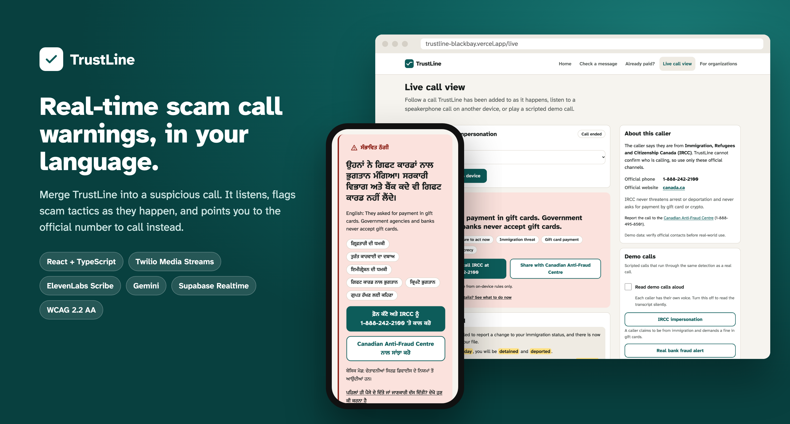
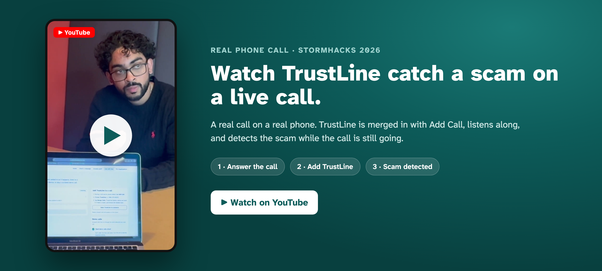
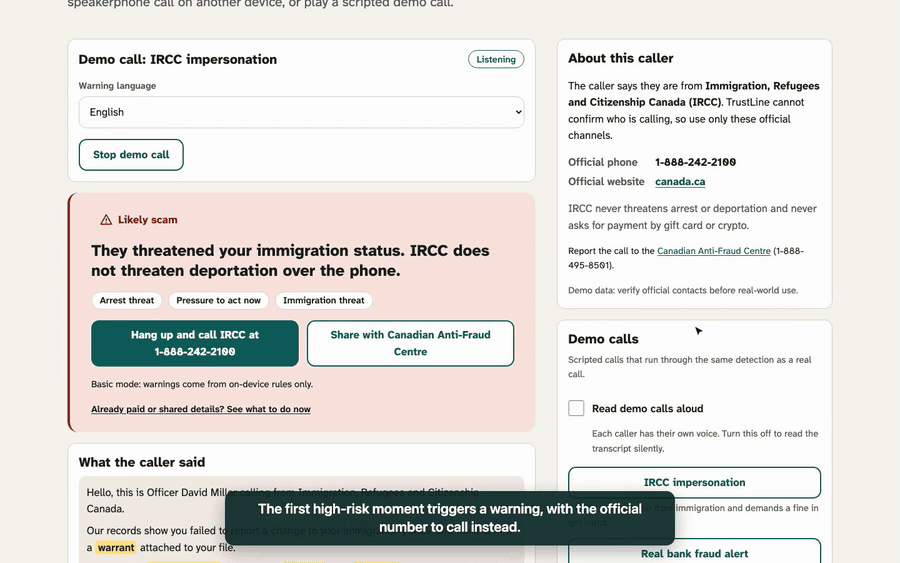
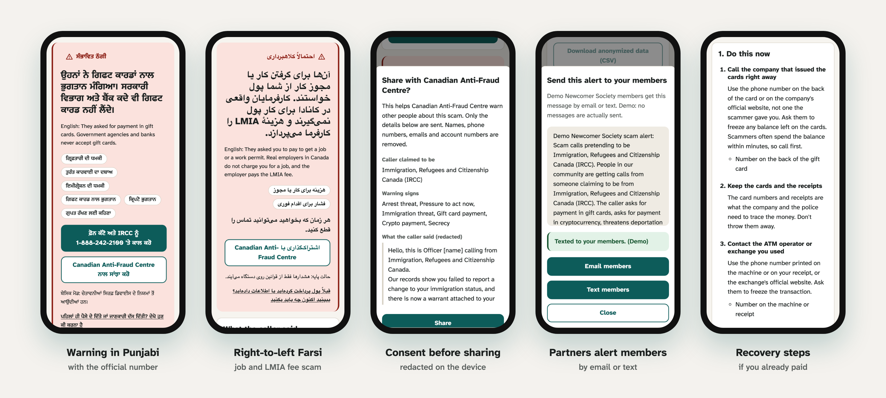
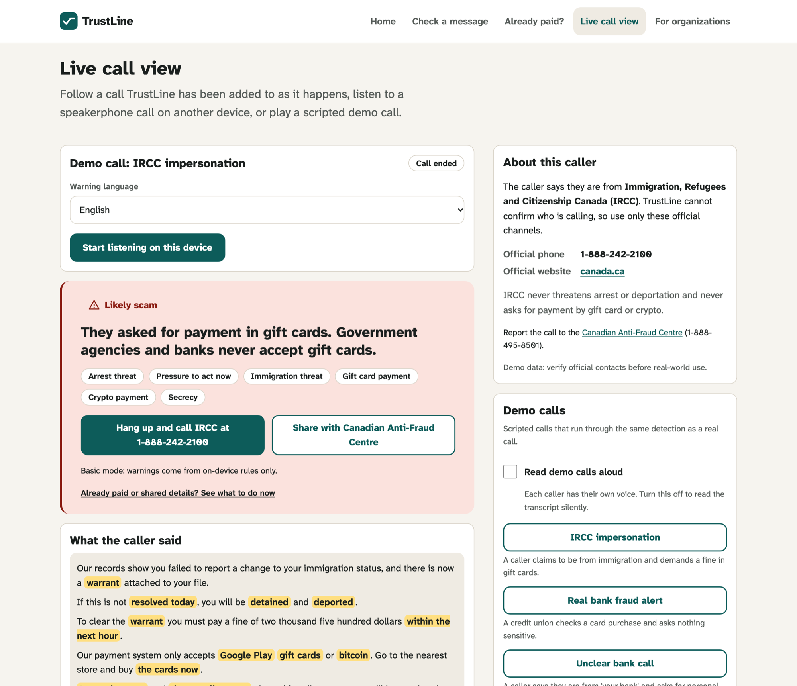
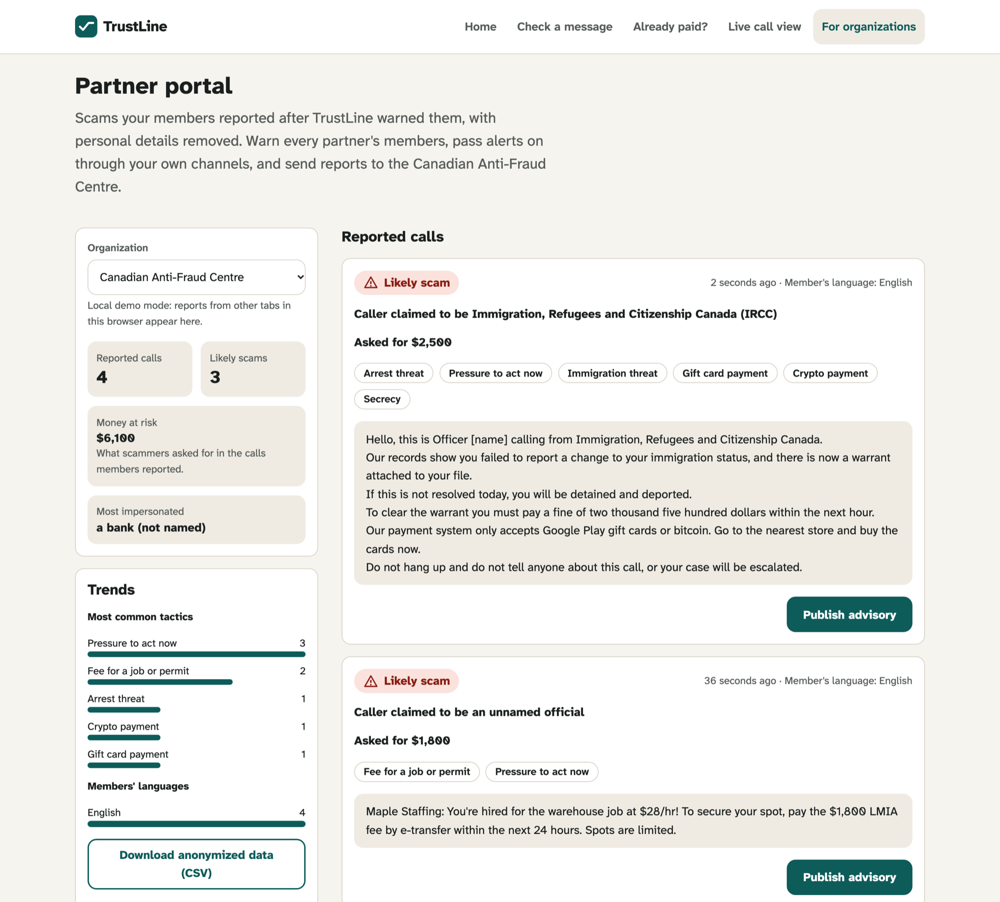
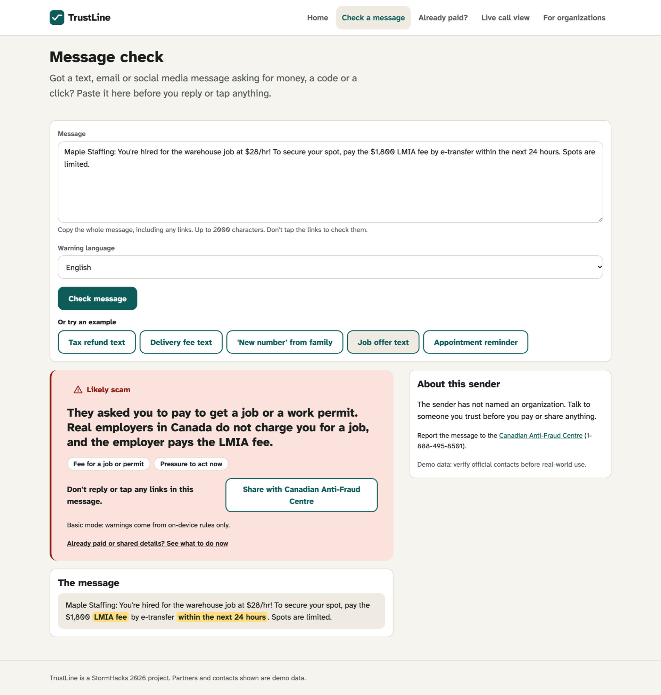
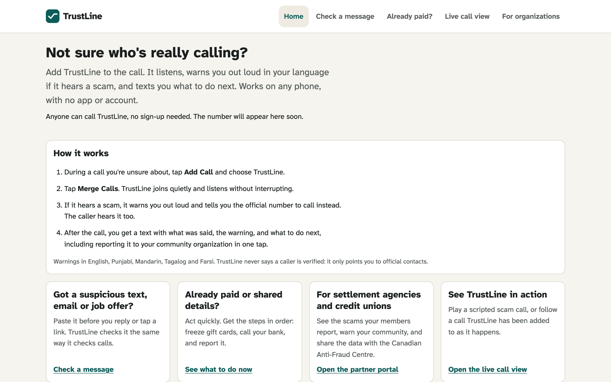

<div align="center">



# TrustLine

**Real-time, in-language scam call warnings for newcomers to Canada, with a shared advisory network between community organizations, credit unions and the Canadian Anti-Fraud Centre.**

[](https://react.dev)
[](https://www.typescriptlang.org)
[](https://www.twilio.com/docs/voice/media-streams)
[](https://elevenlabs.io)
[](https://ai.google.dev)
[](https://supabase.com)
[](#testing)
[](ACCESSIBILITY.md)
[](LICENSE)

[Live site](https://trustline-blackbay.vercel.app) · [Real call video](https://www.youtube.com/shorts/sm245cWq8DM) · [App walkthrough](https://trustline-blackbay.vercel.app/demo/trustline-demo.mp4) · [How it works](#how-it-works) · [Run it locally](#getting-started)

Built in 36 hours at **StormHacks 2026** by [Ariel Tyson](https://github.com/arieltyson) and [Rishon Ghosh](https://github.com/rishon-g).

</div>

## Demo

### A real phone call

<a href="https://www.youtube.com/shorts/sm245cWq8DM"></a>

**[▶ Watch on YouTube](https://www.youtube.com/shorts/sm245cWq8DM)**: Ariel calls Rishon pretending to be Walmart: a washing machine delivery was delayed, and they want to refund him, but only if he reads out his credit card number. Rishon adds TrustLine to the call, and it detects the scam while the call is still going.

### Walkthrough of the app

<a href="https://trustline-blackbay.vercel.app/demo/trustline-demo.mp4"></a>

**[▶ Watch the full 95-second walkthrough](https://trustline-blackbay.vercel.app/demo/trustline-demo.mp4)** (captioned, no audio): a scripted scam call, the live warning, consent-based reporting to the Canadian Anti-Fraud Centre, the partner portal, a published advisory, and the message check.

## The problem

Newcomers are frequent targets of phone scams: callers pose as immigration (IRCC), the CRA or a bank, threaten deportation or arrest, and demand gift cards or crypto within the hour. The warning signs are well known to settlement workers, but the person on the phone has to recognize them alone, under pressure, often in their second or third language.

## What TrustLine does

TrustLine was designed with newcomers in mind, but the tactics it listens for show up in scams aimed at anyone, from fake immigration officers to a fake retailer offering a refund in exchange for your card number.

**The product is a phone number.** During a suspicious call, the user taps Add Call, dials TrustLine and merges it in, the same way they would add a friend to a three-way call. There is no app to install.

1. **Listens in real time.** The call audio streams to TrustLine, which transcribes it and checks every sentence for scam tactics: gift card or crypto payment, deportation and arrest threats, one-time code requests, remote access, secrecy, and fees for jobs, LMIAs or work permits.
2. **Warns out loud, in the user's language.** On the first high-risk moment, TrustLine speaks a warning into the call in English, Punjabi, Mandarin, Tagalog or Farsi, and names the official number for the organization the caller claimed to be, from a verified directory.
3. **Follows up by text.** After a warned call, the user gets a link to a call summary: the transcript with the evidence highlighted, the amount the caller asked for, the official contact, and recovery steps if they already paid.
4. **Turns one call into a warning for everyone.** With one tap and an on-screen preview, the user shares a redacted report with the Canadian Anti-Fraud Centre. Partners see reports in a live portal, publish advisories to every partner, and pass them on to their members by email or text.

## Engineering highlights

- **A real-time voice pipeline.** Twilio Media Streams send 8 kHz mu-law audio over a WebSocket to a Node call server, which forwards it to ElevenLabs Scribe v2 Realtime, scores each committed segment, speaks the warning back into the call with ElevenLabs TTS, and streams events to the web app over Server-Sent Events.
- **Two detection layers, fused for safety.** A rules layer flags known tactics in about 0.02 ms per transcript. Gemini reads the recent transcript and returns schema-constrained JSON (median 1.1 s, p90 1.4 s), validated with Zod on the server and again in the browser. Rules can raise the risk immediately; the LLM can lower it, but never when the rules found gift cards, crypto, one-time codes or remote access.
- **Degrades gracefully.** If Gemini is rate-limited, slow or unconfigured, the app says so and keeps warning from the rules layer ("basic mode"). The public site runs that way today, with no paid API keys.
- **Evidence, not vibes.** Every warning quotes the exact words that triggered it, and the transcript highlights them.
- **Privacy by design.** API keys stay on the server, the browser gets single-use transcription tokens, and reports are redacted on the device (names, phone numbers, emails, account numbers) before the user sees and approves exactly what is sent.
- **Accessible and multilingual.** WCAG 2.2 AA as a requirement: axe-core clean in light and dark themes, full keyboard support, focus management for confirmations, and right-to-left layout for Farsi.
- **Measured.** 187 unit tests (detection, fusion, redaction, directory matching, colour contrast, and the call server against a fake Twilio stream), plus an evaluation harness over 18 labelled calls run in CI on every push.

## Screenshots



<table>
  <tr>
    <td width="50%" valign="top"><br><sub><b>Live call view.</b> Warning, evidence and the official IRCC number.</sub></td>
    <td width="50%" valign="top"><br><sub><b>Partner portal.</b> Redacted reports, money at risk and trends.</sub></td>
  </tr>
  <tr>
    <td width="50%" valign="top"><br><sub><b>Message check.</b> The same detection for texts and job offers.</sub></td>
    <td width="50%" valign="top"><br><sub><b>Home.</b> Built around the number: add it to any call.</sub></td>
  </tr>
</table>

## How it works

Neither iOS nor Android lets third-party apps read cellular call audio, so TrustLine joins the call as a participant instead.

```
Phone call ──merge──▶ Twilio number ──media stream──▶ call server (server/)
                                                         │  Scribe ─▶ rules + Gemini ─▶ spoken warning ─▶ back into the call
                                                         ▼
                                              Server-Sent Events ─▶ app (same pipeline as below)

Microphone ──▶ Scribe v2 Realtime ──▶ committed segments
                                         │
                       ┌─────────────────┴─────────────────┐
                       ▼                                   ▼
                Rules layer (instant)             /api/score (Gemini)
                       └──────────────┬────────────────────┘
                                      ▼
                         fuse() ──▶ warning, evidence, verified contact
                                      │ (consent)
                                      ▼
              redact() ──▶ incidents ──▶ partner portal ──▶ advisories ──▶ every partner's members
```

- **Structure**: feature folders (`src/features/call`, `src/features/partner`, …) with shared logic in `src/lib`, serverless routes in `api/`, and the long-running call server in `server/`
- **State**: React state and hooks; one `CallAnalysis` component per call, keyed so state resets between calls
- **Data**: a `DataStore` interface with a Supabase implementation (Postgres, row-level security, Realtime) and a local one (localStorage + BroadcastChannel) used when Supabase is not configured
- **Target**: current mobile Safari and Chrome; Node 20+

## Features

| Route             | What it does                                                                                                                                                                                                      |
| ----------------- | ----------------------------------------------------------------------------------------------------------------------------------------------------------------------------------------------------------------- |
| `/`               | Home page built around the TrustLine number, with Save to contacts and how merging works                                                                                                                          |
| `/live`           | Follow a merged call as it happens, listen to a speakerphone call on another device, or play a scripted demo call                                                                                                 |
| `/after-call/:id` | The call summary the after-call text links to: transcript, evidence, amount asked for, what TrustLine said, verified contact, recovery steps and one-tap reporting                                                |
| `/check`          | Paste a suspicious text, email or job offer and get the same evidence-backed warning                                                                                                                              |
| `/recover`        | If someone already paid or shared details: what to do, in order, based on the Canadian Anti-Fraud Centre's victim guidance                                                                                        |
| `/partner`        | Partner portal: redacted reports, money at risk, trends by tactic and language, advisories partners can email or text to members (demo: nothing is sent), a pre-filled Anti-Fraud Centre report, and a CSV export |

**UN Sustainable Development Goals.** Goal 8 (decent work and economic growth): 8.10, keeping newcomers' trust in banking and financial services, and 8.8, protecting migrant workers from job and LMIA fee scams. Goal 17 (partnerships): 17.17, one shared channel between civil society, credit unions and the public sector.

## Tech stack

| Layer        | Technology                                                                                                                         |
| ------------ | ---------------------------------------------------------------------------------------------------------------------------------- |
| Web app      | React 19, TypeScript (strict), Vite, Zod                                                                                           |
| Call server  | Node, `ws`, Twilio Programmable Voice and Media Streams, Docker                                                                    |
| Speech       | ElevenLabs Scribe v2 Realtime (speech to text), Eleven v3 (spoken warnings and demo callers), ElevenLabs Agents (scripted callers) |
| Risk scoring | Google Gemini (`gemini-3.5-flash-lite` by default) over REST with a response schema; no SDK                                        |
| Data         | Supabase Postgres, row-level security and Realtime                                                                                 |
| Hosting      | Vercel (site and serverless API routes); Railway or any Docker host (call server)                                                  |
| Quality      | Vitest, ESLint, Prettier, GitHub Actions CI, axe-core                                                                              |

## Live demo

**The hackathon demo has ended.** The TrustLine number (+1 604-373-6537) has been released and the hosted call server shut down, so phone calls no longer work. The website is still online at **[trustline-blackbay.vercel.app](https://trustline-blackbay.vercel.app)** in basic mode: warnings come from the rules layer only, and demo calls are read by the browser's voice instead of ElevenLabs. Try the [demo calls](https://trustline-blackbay.vercel.app/live), the [message check](https://trustline-blackbay.vercel.app/check) and the [partner portal](https://trustline-blackbay.vercel.app/partner). To run the full system, including phone calls, follow [Getting started](#getting-started) with your own keys.

## Getting started

```bash
npm install
cp .env.example .env   # add keys; every key is optional
npm run dev
```

### Gemini API key (free)

1. Sign in to [Google AI Studio](https://aistudio.google.com/apikey) and create an API key. No billing account is needed for the free tier.
2. Put it in `.env` as `GEMINI_API_KEY` locally, and in the Vercel (and call server) environment variables for deployments. It is only read on the server; never prefix it with `VITE_`.
3. Optionally set `GEMINI_MODEL` to another free-tier model, such as `gemini-3.5-flash`, if you want stronger reasoning at some cost in latency.

Free-tier limits are per model and shown in [AI Studio](https://aistudio.google.com/rate-limit). If scoring is rate-limited or slow, the app falls back to the rules layer and says it is in basic mode. On the free tier, Google may use prompts to improve its products, so use demo calls rather than real ones until you move to a paid key (see [PRIVACY.md](PRIVACY.md)).

`npm run dev` serves the same routes as the [live demo](#live-demo): `/` for the home page, `/live` for the live call view and demo calls, and `/partner` for the partner portal.

| Setting                                       | Without it                                                                                                                    |
| --------------------------------------------- | ----------------------------------------------------------------------------------------------------------------------------- |
| `ELEVENLABS_API_KEY`                          | Live listening is unavailable; demo calls still work and are read aloud by the browser's built-in voice instead of ElevenLabs |
| `GEMINI_API_KEY`                              | Basic mode: warnings come from the rules layer only                                                                           |
| `GEMINI_MODEL`                                | Uses `gemini-3.5-flash-lite`                                                                                                  |
| `VITE_SUPABASE_URL`, `VITE_SUPABASE_ANON_KEY` | Incidents and advisories are shared between tabs of one browser instead of across devices                                     |

### Phone calls (merge TrustLine into a call)

The StormHacks demo number (+1 604-373-6537) was released after the event. To try phone calls, set up your own number with the steps below.

#### Set up a separate deployment

1. Buy a phone number in the Twilio console.
2. Deploy the call server with the `Dockerfile` on an always-on host such as Railway, Fly.io or Render. Set `ELEVENLABS_API_KEY`, `GEMINI_API_KEY`, `PUBLIC_URL` (the server's https URL), `TWILIO_AUTH_TOKEN`, `APP_ORIGIN` (the web app's URL) and `PHONE_LINKS` (which demo user each of your phones belongs to). For the after-call text, also set `TWILIO_ACCOUNT_SID` and `TWILIO_PHONE_NUMBER` (the number that sends it; defaults to `VITE_TRUSTLINE_NUMBER`). Without them, or with `APP_ORIGIN` unset, calls still work and the live call view still offers "Open the call summary", but no text is sent.
3. In Twilio, set the number's "A call comes in" webhook to `POST https://<call server>/twilio/voice`.
4. Set `VITE_CALL_SERVER_URL` and `VITE_TRUSTLINE_NUMBER` for the web app and redeploy it.
5. Call someone, tap Add Call, call the TrustLine number and tap Merge Calls.

To develop the call server against real calls, run `npm run server`, expose port 8787 with a tunnel (`npx cloudflared tunnel`, see the Twilio guide), use the tunnel URL as `PUBLIC_URL`, and point the Twilio webhook at it. This takes calls away from the hosted demo, so tell the team and point the webhook back at Railway afterwards.

To rehearse without Twilio, run `npm run simulate:call -- ircc-scam` and run the app with `VITE_CALL_SERVER_URL` set to your local call server (port 8787). The simulator runs the real call server, plays a demo script as a merged call, and speaks the warning if `ELEVENLABS_API_KEY` is set.

### Supabase

Run `supabase/migrations/0001_init.sql` and then `supabase/seed.sql` in the Supabase SQL editor. The seed file is generated from `src/data` with `npm run db:seed-sql`.

### Demo callers

With `ELEVENLABS_API_KEY` set, `npm run demo:agents` creates two ElevenLabs agents: an IRCC impersonator and a genuine credit union fraud alert. Play one on a laptop next to the phone running TrustLine.

### Deploying

The web app deploys to Vercel (`vercel.json` serves the single-page app, and the files in `api/` deploy as functions); the public site redeploys on every push to `main`. The call server runs anywhere that can hold a WebSocket open, from the `Dockerfile` (`railway.json` configures Railway). The hosted call server was shut down after StormHacks; the [public hosting guide](docs/shared-plans/TrustLine-Public-Demo-Hosting-Guide.md) explains how to set it up again.

## Testing

```bash
npm test         # unit tests, including the call server with a fake Twilio stream
npm run eval     # precision, recall and latency on the labelled call set
npm run lint
npm run typecheck
```

Rules-only results on the 18-case set: 100% precision and 92% recall (11 of 12 scams) when warning at medium risk or above, with no false positives on the 6 legitimate calls. The cases were written alongside the rules, so these numbers are optimistic. The missed case, a request for an Interac payment with no other keywords, is the kind the LLM layer is there to catch; set `GEMINI_API_KEY` to include it in the report.

## Team

Built in 36 hours at StormHacks 2026 by team Black Bay:

- **Ariel Tyson** ([@arieltyson](https://github.com/arieltyson))
- **Rishon Ghosh** ([@rishon-g](https://github.com/rishon-g))

Partners and contacts in the app are demo data. Verify official contacts before real-world use.

## License

Released under the MIT License. See [`LICENSE`](LICENSE).
