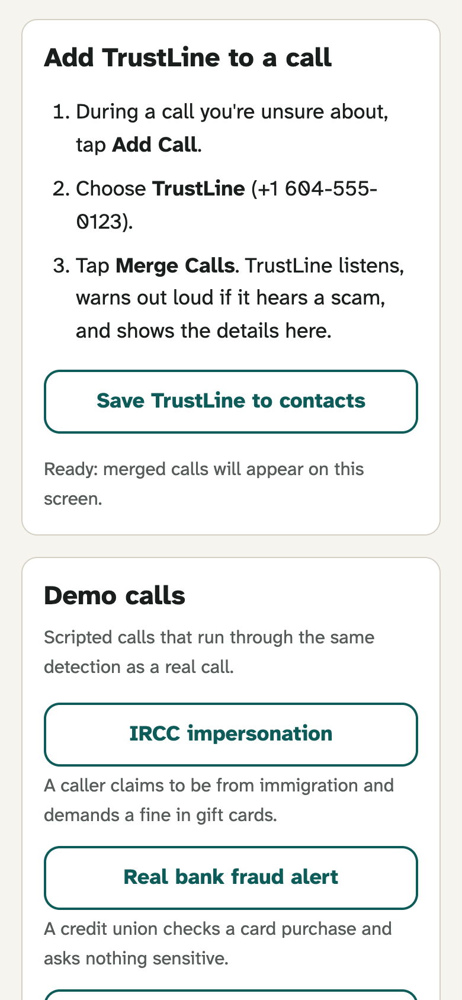
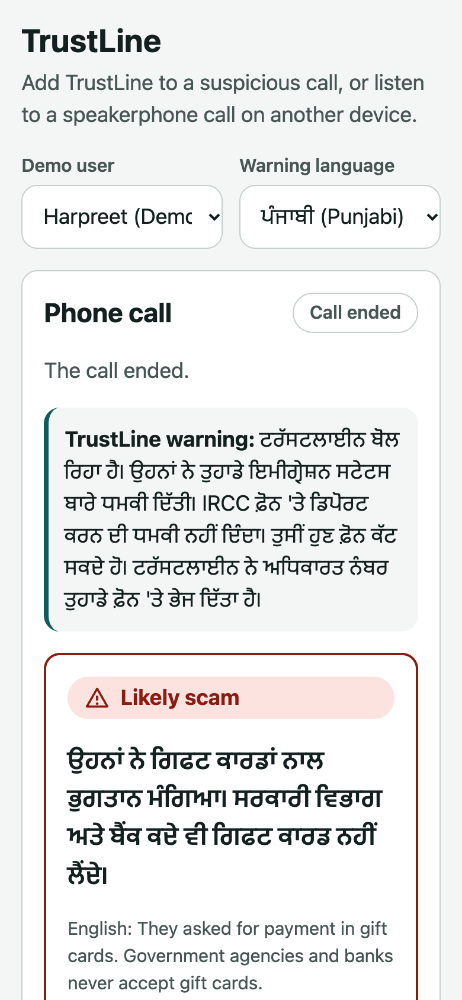
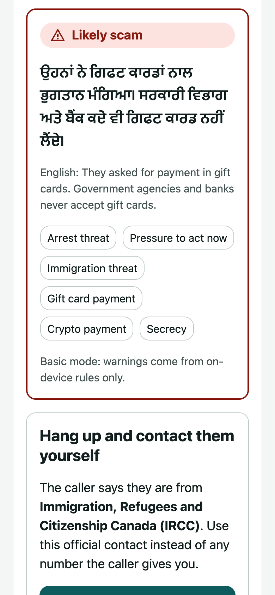
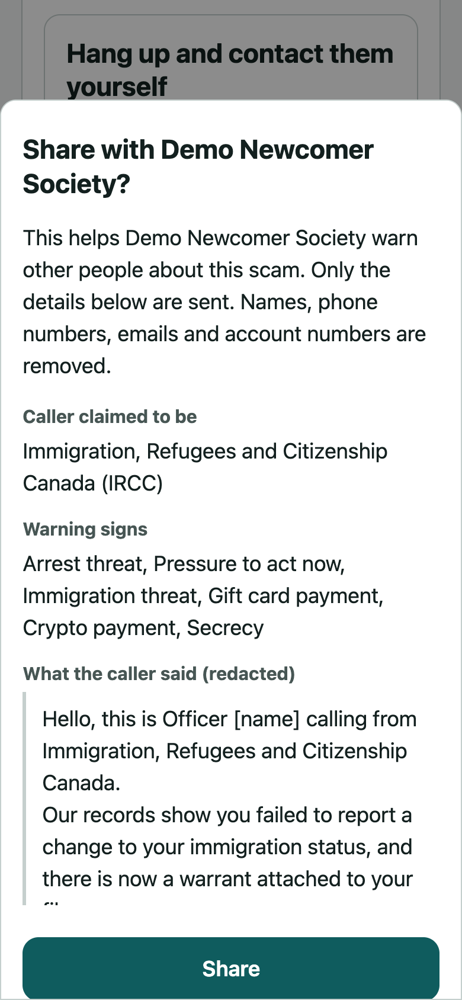
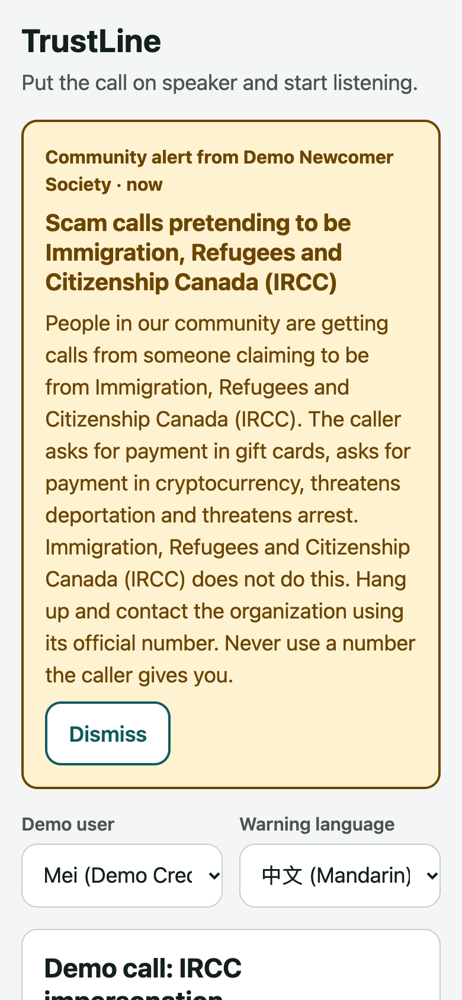
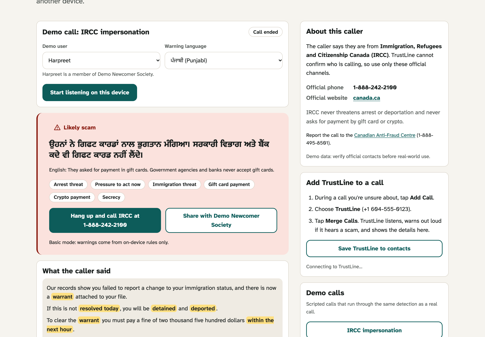
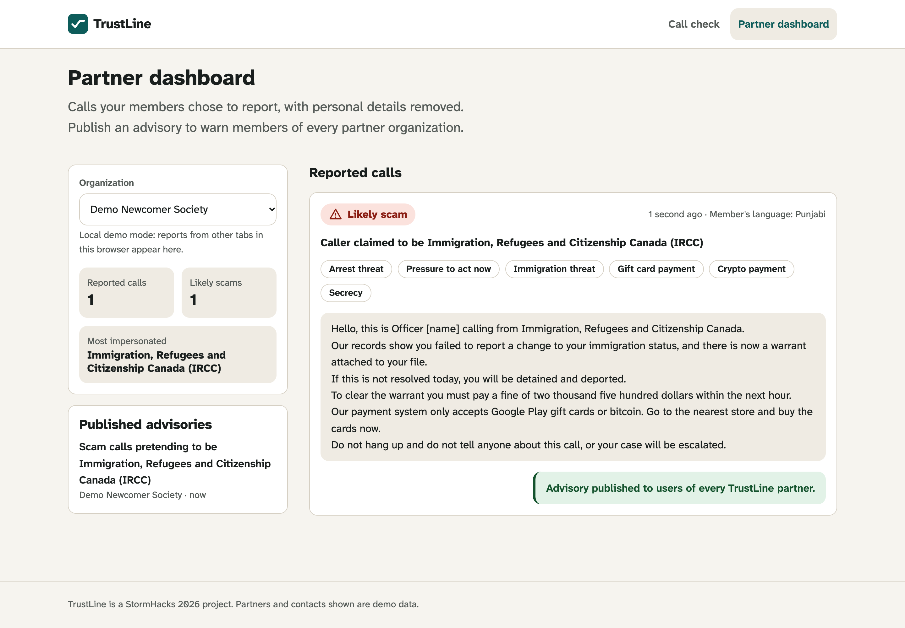

<div align="center">

# TrustLine 📞

## Project Description 🚨

TrustLine helps newcomers to Canada recognize scam tactics during financial phone calls. **The product is a phone number.** During a suspicious call, the user taps Add Call, dials TrustLine and merges it in, the same way they would add a friend to a three-way call. No app to install. TrustLine transcribes the conversation in real time, flags tactics such as gift card payment requests, deportation threats, one-time code requests and fees for jobs or work permits, and warns the user out loud on the call in their chosen language. When the caller claims to represent an institution, TrustLine names that institution's official contact channel from a verified directory so the user can hang up and check independently.

After a call that triggered a warning, TrustLine texts the user a link to a **call summary page**: the transcript, the highlighted evidence, the amount the caller asked for, the verified contact, recovery steps and a one-tap consent to report it. The website is mainly a **partner portal** for settlement agencies and credit unions: redacted reports from their members, money at risk, scam trends by tactic and language, advisories they can publish to every partner and send to their members, a pre-filled Canadian Anti-Fraud Centre report, and a CSV export.

**UN SDGs.** Goal 8 (decent work and economic growth): 8.10, keeping newcomers' trust in banking and financial services, and 8.8, protecting migrant workers from job and LMIA fee scams. Goal 17 (partnerships): 17.17, one shared channel between civil society, credit unions and the public sector.

## Screenshots:

<div style="display: flex; justify-content: center; align-items: center;">
    <kbd></kbd>
    <kbd></kbd>
    <kbd></kbd>
    <kbd></kbd>
    <kbd></kbd>
</div>

<div align="center">
    <kbd></kbd>
    <kbd></kbd>
</div>

## Technologies Used 💻

### Frameworks

- [x] **React + TypeScript (Vite)**: Mobile-first single-page app with strict TypeScript
- [x] **Supabase Realtime**: Live incident feed and advisory banners across devices
- [x] **Zod**: Validation of every risk assessment on the server and again in the browser
- [x] **Vitest**: Unit tests for detection, fusion, redaction, directory matching and colour contrast

### APIs & Web Services

- [x] **ElevenLabs Scribe v2 Realtime**: Streaming speech-to-text from the microphone
- [x] **ElevenLabs Text to Speech (Eleven v3)**: Spoken warnings in all five languages, generated as phone audio
- [x] **ElevenLabs Agents**: Scripted scam and legitimate callers for testing and the demo
- [x] **Twilio Programmable Voice**: The TrustLine phone number and bidirectional Media Streams
- [x] **Google Gemini API (free tier, `gemini-3.5-flash-lite` by default)**: Structured risk scoring and translated explanations, called over REST with no extra SDK
- [x] **Vercel**: Hosting and serverless API routes

### Data Sources

- [x] **Verified directory**: Official contact channels for IRCC, CRA, CBSA, Service Canada, police and major banks (demo data, see `src/data/directory.ts`)
- [x] **Evaluation set**: 17 labelled scam and legitimate call transcripts in `eval/cases.ts`

</div>

## Architecture 🏗️

- **Pattern**: Feature folders (`src/features/call`, `src/features/partner`) with shared logic in `src/lib`
- **Detection**: A rules layer flags known tactics in about 0.01 ms per transcript. Gemini reads the recent transcript and returns schema-constrained JSON (validated again with Zod) with flags, the claimed organization, exact evidence quotes and an explanation in the listener's language. Rules can raise risk immediately; only the LLM can lower it, and never when the rules found gift cards, crypto, one-time codes or remote access.
- **Input**: Neither iOS nor Android lets third-party apps read cellular call audio. Instead, the user merges the TrustLine number into the call. A call server receives the audio from Twilio, sends it to Scribe (which accepts Twilio's 8 kHz mu-law directly), scores it, speaks a warning back into the call on the first high-risk moment, and streams the call to the user's app over Server-Sent Events. The app can also listen through the microphone of a second device, and scripted demo calls run through the same pipeline.
- **State**: React state and hooks; one `CallAnalysis` component per call, keyed so state resets between calls
- **Data**: `DataStore` interface with a Supabase implementation and a local implementation (localStorage + BroadcastChannel) used when Supabase is not configured
- **Security**: API keys stay on the server. The browser receives single-use transcription tokens. Incidents are redacted on the device before they are sent.
- **Target**: Current mobile Safari and Chrome; Node 20+

```
Phone call ──merge──▶ Twilio number ──media stream──▶ call server (server/)
                                                         │  Scribe ─▶ rules + Gemini ─▶ spoken warning ─▶ back into the call
                                                         ▼
                                              Server-Sent Events ─▶ app (same pipeline as below)

Microphone ──▶ Scribe v2 Realtime ──▶ committed segments
                                         │
                       ┌─────────────────┴─────────────────┐
                       ▼                                   ▼
                Rules layer (instant)             /api/score (Gemini)
                       └──────────────┬────────────────────┘
                                      ▼
                         fuse() ──▶ warning, evidence, verified contact
                                      │ (consent)
                                      ▼
              redact() ──▶ incidents ──▶ partner dashboard ──▶ advisories ──▶ every partner's users
```

## Features 🌟

- ☎️ **The TrustLine number** (`/`): The home page is built around the number, with a Save to contacts button and how merging works
- 📲 **After-call text and call summary** (`/after-call/:id`): When a merged call ends after a warning, the call server texts the caller a link to the summary: transcript, evidence, amount asked for, what TrustLine said on the call, verified contact, recovery steps and one-tap reporting. Summaries are kept in memory on the call server for one day
- 🏢 **Partner portal** (`/partner`): Redacted member reports, money at risk, trends by tactic and language, advisories with a "Send to members" message, a pre-filled Canadian Anti-Fraud Centre report per incident, and a CSV export (no transcript excerpts)
- 💼 **Job offer scams**: A warning sign for anyone asking for a fee to get a job, an LMIA or a work permit (Goal 8.8), with a demo call and an example message
- 🎙️ **Live call view** (`/live`): Follow a merged call as it happens, listen to a speakerphone call on another device, or play a demo call
- 🚩 **Evidence-backed warnings**: The exact words that triggered each flag are highlighted
- 🌐 **In-language explanations**: Warnings in English, Punjabi, Mandarin, Tagalog and Farsi, with right-to-left layout for Farsi
- ☎️ **Verified next step**: Official contact channels instead of caller-supplied numbers
- 💬 **Message check** (`/check`): Paste a suspicious text, email or social media message and get the same evidence-backed warning, verified contacts and sharing as a call, including a warning sign for suspicious links
- 🧭 **Recovery steps** (`/recover`): If someone already paid or shared details, a checklist of what to do in order (freeze gift cards, call the bank, credit bureau fraud alerts, police and Canadian Anti-Fraud Centre reports), based on the CAFC's victim guidance. Warnings link to it with the right situations already ticked
- 🤝 **Partner advisories**: Consent-based, redacted reports shared across community organizations and banks
- 🔊 **Spoken demo calls**: Demo calls are acted out by ElevenLabs Eleven v3 voices, one per caller, with audio tags for tone (a stern fake officer, a warm real bank) (or the browser's voice without a key), with the transcript appearing in time with the speech. A checkbox turns it off
- 📊 **Diagnostics**: Measured alert latency for the rules and LLM layers

## Getting Started 🚀

```bash
npm install
cp .env.example .env   # add keys; every key is optional
npm run dev
```

### Gemini API key (free)

1. Sign in to [Google AI Studio](https://aistudio.google.com/apikey) and create an API key. No billing account is needed for the free tier.
2. Put it in `.env` as `GEMINI_API_KEY` locally, and in the Vercel (and call server) environment variables for deployments. It is only read on the server; never prefix it with `VITE_`.
3. Optionally set `GEMINI_MODEL` to another free-tier model, such as `gemini-3.5-flash`, if you want stronger reasoning at some cost in latency.

Free-tier limits are per model and shown in [AI Studio](https://aistudio.google.com/rate-limit). If scoring is rate-limited or slow, the app falls back to the rules layer and says it is in basic mode. On the free tier, Google may use prompts to improve its products, so use demo calls rather than real ones until you move to a paid key (see [PRIVACY.md](PRIVACY.md)).

Open `http://localhost:5173` for the home page, `/live` for the live call view and demo calls, and `/partner` for the partner portal.

| Setting                                       | Without it                                                                                                                    |
| --------------------------------------------- | ----------------------------------------------------------------------------------------------------------------------------- |
| `ELEVENLABS_API_KEY`                          | Live listening is unavailable; demo calls still work and are read aloud by the browser's built-in voice instead of ElevenLabs |
| `GEMINI_API_KEY`                              | Basic mode: warnings come from the rules layer only                                                                           |
| `GEMINI_MODEL`                                | Uses `gemini-3.5-flash-lite`                                                                                                  |
| `VITE_SUPABASE_URL`, `VITE_SUPABASE_ANON_KEY` | Incidents and advisories are shared between tabs of one browser instead of across devices                                     |

### Phone calls (merge TrustLine into a call)

**StormHacks demo number: [+1 604-373-6537](tel:+16043736537).** This number is already provisioned; use it for the team demo.

#### Use the number with the app

1. On Ariel's laptop, open [the live call view](http://localhost:5173/live), select **Harpreet**, and choose the warning language (for example, Punjabi).
2. Wait until the call card says **“Ready: merged calls will appear on this screen.”** The app, call server, and tunnel must all be running.
3. For a quick test, call **+1 604-373-6537** from Ariel's linked phone. TrustLine joins silently (no greeting). Speak a fictional demo script and watch for the transcript and warning in the app.
4. For a merged-call demo, first call your teammate. On your phone, tap **Add Call**, dial **+1 604-373-6537**, then tap **Merge Calls**. Have your teammate read the scripted scam lines; keep the app open on the laptop to see the transcript and warning. Merge Calls depends on your carrier supporting conference calls.
5. Hang up when finished. The server's call limit is 10 minutes.

The current local setup maps Ariel's phone to Harpreet. To use another phone or demo user, update `PHONE_LINKS` in the server's ignored `.env` and restart the server. Keep the laptop awake: the demo number depends on its call server and Cloudflare tunnel. Restarting the tunnel can change its URL; update both `PUBLIC_URL` and Twilio's POST `/twilio/voice` webhook if that happens. The hosted app needs its own call-server configuration; use the local app for this setup.

The number costs US$1.15/month, plus call and audio-service usage. Release it in Twilio after the event to stop monthly renewal. Automated connectivity checks passed; the real handset and merged-call flow still need a manual test. See the [Twilio phone-call guide](docs/shared-plans/TrustLine-Twilio-Phone-Call-Guide.md) for setup and troubleshooting.

#### Set up a separate deployment

1. Buy a phone number in the Twilio console.
2. Deploy the call server with the `Dockerfile` on an always-on host such as Railway, Fly.io or Render. Set `ELEVENLABS_API_KEY`, `GEMINI_API_KEY`, `PUBLIC_URL` (the server's https URL), `TWILIO_AUTH_TOKEN`, `APP_ORIGIN` (the web app's URL) and `PHONE_LINKS` (which demo user each of your phones belongs to). For the after-call text, also set `TWILIO_ACCOUNT_SID` and `TWILIO_PHONE_NUMBER` (the number that sends it; defaults to `VITE_TRUSTLINE_NUMBER`). Without them, or with `APP_ORIGIN` unset, calls still work and the live call view still offers "Open the call summary", but no text is sent.
3. In Twilio, set the number's "A call comes in" webhook to `POST https://<call server>/twilio/voice`.
4. Set `VITE_CALL_SERVER_URL` and `VITE_TRUSTLINE_NUMBER` for the web app and redeploy it.
5. Call someone, tap Add Call, call the TrustLine number and tap Merge Calls.

For local development, run `npm run server` and expose port 8787 with a tunnel such as `npx cloudflared tunnel --url http://localhost:8787`, then use the tunnel URL as `PUBLIC_URL`.

To rehearse without Twilio, run `npm run simulate:call -- ircc-scam` and open the app with `VITE_CALL_SERVER_URL=http://localhost:8787`. The simulator runs the real call server, plays a demo script as a merged call, and speaks the warning if `ELEVENLABS_API_KEY` is set.

### Supabase

Run `supabase/migrations/0001_init.sql` and then `supabase/seed.sql` in the Supabase SQL editor. The seed file is generated from `src/data` with `npm run db:seed-sql`.

### Demo callers

With `ELEVENLABS_API_KEY` set, `npm run demo:agents` creates two ElevenLabs agents: an IRCC impersonator and a genuine credit union fraud alert. Play one on a laptop next to the phone running TrustLine.

### Deploying

Import the repository in Vercel and add the environment variables above. `vercel.json` serves the single-page app, and the files in `api/` deploy as functions.

## Testing 🧪

```bash
npm test         # unit tests, including the call server with a fake Twilio stream
npm run eval     # precision, recall and latency on the labelled call set
npm run lint
npm run typecheck
```

Rules-only results on the 18-case set: 100% precision and 92% recall (11 of 12 scams) when warning at medium risk or above, with no false positives on the 6 legitimate calls. The cases were written alongside the rules, so these numbers are optimistic. The missed case, a request for an Interac payment with no other keywords, is the kind the LLM layer is there to catch; set `GEMINI_API_KEY` to include it in the report.

<div align="center">

## Contributing ⚙️

Contributions are welcome. Fork the repository, create a feature branch, and open a pull request describing the change and how you tested it. Please open an issue first for larger changes.

## License 🪪

Released under the MIT License. See `LICENSE` for details.

</div>
